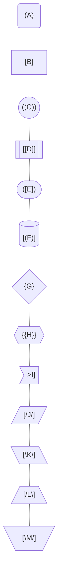

```mermaid
graph TB
  id_a("(A)")
  id_b["[B]"]
  id_c(("((C))"))
  id_d[["[[D]]"]]  
  id_e(["([E])"])
  id_f[("[(F)]")]
  id_g{"{G}"}
  id_h{{"{{H}}"}}
  id_i>">I]"]
  id_j[/"[/J/]"/]  
  id_k[\"[\K\]"\]
  id_l[/"[/L\]"\]
  id_m[\"[\M/]"/]
  
  id_a --- id_b
  id_b --- id_c
  id_c --- id_d
  id_d --- id_e
  id_e --- id_f
  id_f --- id_g
  id_g --- id_h
  id_h --- id_i
  id_i --- id_j
  id_j --- id_k
  id_k --- id_l
  id_l --- id_m
  id_m
```
