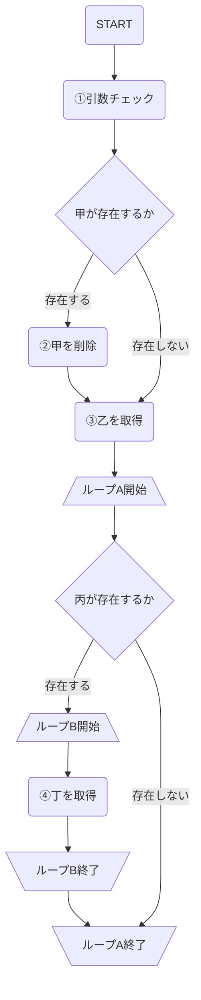

```mermaid
graph TB
  start("START")
  node_1("①引数チェック")
  fork_1{"甲が存在するか"}
  node_2("②甲を削除")
  node_3("③乙を取得")
  loop_1_start[/"ループA開始"\]
  loop_1_end[\"ループA終了"/]  
  fork_2{"丙が存在するか"}
  loop_2_start[/"ループB開始"\]
  loop_2_end[\"ループB終了"/]  
  node_4("④丁を取得")
    
  start --> node_1
  node_1 --> fork_1
  fork_1 --> | 存在する | node_2
  node_2 --> node_3
  fork_1 --> | 存在しない | node_3
  node_3 --> loop_1_start
  loop_1_start --> fork_2
  fork_2 --> | 存在する | loop_2_start
  loop_2_start --> node_4
  node_4 --> loop_2_end
  loop_2_end --> loop_1_end
  fork_2 --> | 存在しない | loop_1_end  
```
