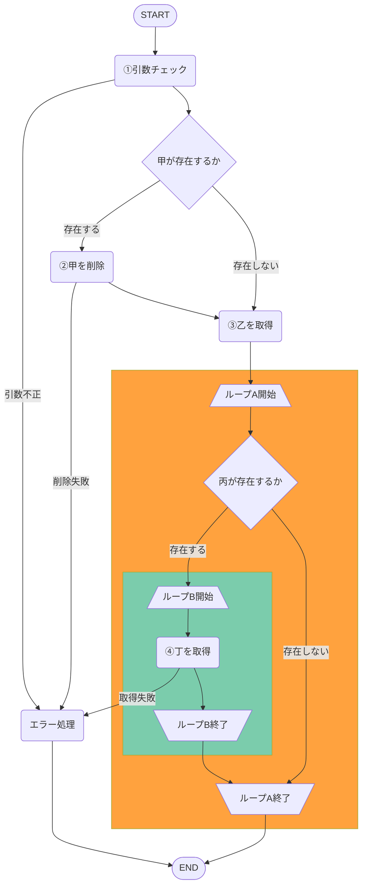

```mermaid
graph TB
  %% ノード定義
  start(["START"])
  node_1("①引数チェック")
  fork_1{"甲が存在するか"}
  node_2("②甲を削除")
  node_3("③乙を取得")
  subgraph loop_1[" "]
    loop_1_start[/"ループA開始"\]
    loop_1_goal[\"ループA終了"/]
    fork_2{"丙が存在するか"}
    subgraph loop_2[" "]
      loop_2_start[/"ループB開始"\]
      loop_2_goal[\"ループB終了"/]  
      node_4("④丁を取得")
    end
  end
  error_1("エラー処理")    
  goal(["END"])

  %% ノードスタイル定義
  style loop_1 fill:#ffa23e
  style loop_2 fill:#7BCCAC

  %% リンク定義
  start --> node_1
  node_1 --> | 引数不正 | error_1  
  node_1 --> fork_1
  fork_1 --> | 存在する | node_2   
  node_2 --> | 削除失敗 | error_1  
  node_2 --> node_3
  fork_1 --> | 存在しない | node_3
  node_3 --> loop_1_start
  loop_1_start --> fork_2
  fork_2 --> | 存在する | loop_2_start
  loop_2_start --> node_4
  node_4 --> | 取得失敗 | error_1    
  node_4 --> loop_2_goal
  loop_2_goal --> loop_1_goal
  fork_2 --> | 存在しない | loop_1_goal
  loop_1_goal --> goal
  error_1 --> goal  
```
